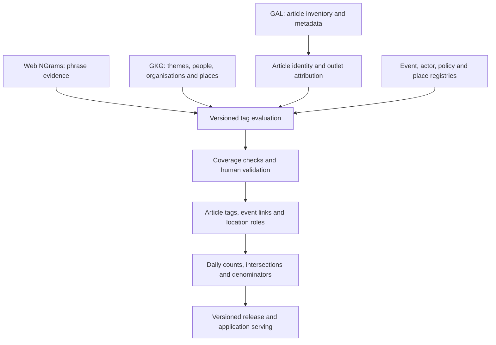

# GDELT article tagging pipeline plan

Date: 28 September 2026  
Status: Proposed implementation plan; no live collection or deployment performed  
Scope: UK news pilot, initially English-language coverage  
Decision: Use BigQuery, GAL, Web NGrams and GKG with versioned rules and human validation. Exclude Jev. No production LLM dependency in the initial release.

## 1. Objective and architecture decision

Build a reusable article-level dataset that supports overlapping tags for:

- Themes: climate change, electric vehicles and fuel prices, alongside existing project topics.
- Specific events: a particular storm, flood, wildfire, policy announcement or other tracked event.
- Wider event categories: storms, floods, wildfires and selected non-weather categories.
- Political content: named actors, parties and policies, plus generic political references.
- Publication: the outlet, edition/domain and publishing geography.
- Geography: places mentioned, the event location and the publication's location or coverage area.

BigQuery is the query and analytical storage platform. GDELT's Global Knowledge Graph (GKG) is a dataset of extracted metadata available through BigQuery. Use both; a separate graph database is unnecessary for the proposed counts, filters and intersections.

Keep one article identity independent of how many queries or tags match it. Preserve raw evidence, evaluation status and classifier versions so that every chart can be traced back to the captured articles and the rules applied.



## 2. Existing foundation and gaps

Extend the current implementation rather than replace it:

| Component | Existing foundation | Planned change |
| --- | --- | --- |
| [NGrams collector](../src/climate_attention/sources/gdelt_ngrams.py) | Batched phrase matching, political flags, GAL metadata joins, article retention, estimates and byte caps | Retain a reusable article inventory; add independent event-category candidates and GKG enrichment |
| [Topic configuration](../config/topics.uk-pilot.yaml) | Draft English phrase sets | Use fuel prices as the selected price topic; retain transport tags |
| [Political configuration](../config/political_signals.uk-pilot.yaml) | Generic actor/action/party phrases and official domains | Add stable actor, party and policy identities with dated aliases |
| [Outlet registry](../config/outlet_registry.yaml) | Small unreviewed seed panel | Review domains/editions, source type, publishing geography and coverage areas |
| [Contracts](../src/climate_attention/contracts.py) | Topic-specific article records and match evidence | Introduce topic-independent articles and many-to-many tag/event/location records |
| [Live on-ramp](LIVE_DATA_ONRAMP.md) | Proposed resumable collection and release bridge | Extend with capture manifests, GKG coverage and tagging-stage status |

The current collector does not query GKG. Its bounded case/punctuation anchor variants can miss matches; measure that trade-off before broadening the query. The historical domain-country lookup is an April 2015 snapshot and must not be the sole authority for the UK corpus.

This document specifies proposed behaviour. Existing methodology and output contracts remain descriptions of the current implementation until a versioned migration is delivered.

## 3. Define the article universe before collecting topics

Start with all captured GAL URLs belonging to a reviewed UK news-outlet/edition registry for the chosen dates and language scope. A publisher's headquarters or a `.uk` suffix alone does not define a UK news edition. Preserve excluded, ambiguous and unmapped sources for coverage audits.

Use this explicit label: **GDELT-captured articles in the defined UK outlet universe**. Do not label it all UK journalism or UK audience attention. An English-only release must disclose Welsh-language and other language gaps.

Keep government, parliamentary and party websites as a separate source class. Their pages may be useful political evidence, but must not silently enter the news denominator. An official source is an outlet attribute, not proof that an article mentions a particular political actor.

Retain the inexpensive article inventory even when an article has no tracked tag. Retrieve and classify storm, flood, wildfire and tracked-event candidates independently of climate or EV matches. Otherwise conditional metrics are biased at collection time.

Retain per-day URL membership or a reproducible manifest plus digest, not just a total count.

## 4. Source responsibilities and coverage

| Source | Role | Important boundary |
| --- | --- | --- |
| `gdelt-bq.gdeltv2.gal` | Article inventory, URLs, titles, descriptions and publisher metadata | Fields may be missing; its date can represent publication or observation |
| `gdelt-bq.gdeltv2.webngrams` | Phrase matching in indexed text, context snippets and position deciles | Context is partial; absence of a match does not establish complete text coverage |
| `gdelt-bq.gdeltv2.gkg_partitioned` | Extracted themes, persons, organisations and locations | Machine-extracted candidates, not validated project labels or a full-text store |
| External event feeds and a sourced manual registry | Canonical hazard and non-weather event records | Distinguish warnings, detections and observed impacts |
| GDELT Events/EventMentions | Optional enrichment for relevant coded interactions | Do not treat GDELT event IDs as canonical named-storm or wildfire IDs |

Verify table schemas, partition fields, available dates, freshness and URL overlap during the pilot. GKG, NGrams and GAL are not assumed to contain identical article sets.

Normalize each source to one article snapshot before joining. Preserve the raw URL and a conservative normalized URL; record aliases and conflicts. Left-join GKG enrichment so missing GKG rows do not discard GAL articles. Aggregate repeated GKG entities and NGrams evidence before joining to prevent row multiplication.

Keep `first_seen_at`, source-provided date, `published_at` where established, and `date_basis`. Use a consistent UTC first-seen day for the initial inventory and its aggregates. Any publication-date series must document fallback and revision behaviour; do not mix source dates silently.

## 5. Tagging methods

### 5.1 Separate mentions from substantive coverage

Support distinct assertions:

- `mentions_theme`: an explicit, relevant reference occurs in available evidence.
- `about_theme`: the theme is a substantive subject of the article.
- `links_event_to_theme`: the article explicitly connects an event to a theme.

An article can mention a flood and climate change in unrelated paragraphs. Co-occurrence is sufficient for a metric called “flood articles mentioning climate change”; it is insufficient for “articles attributing this flood to climate change”.

The initial automated release should prioritise validated mention tags. Mark substantive relevance and explicit relationships unknown where context is insufficient. Do not infer endorsement from a mention: an article denying climate change still mentions it.

### 5.2 Themes and broad event categories

Maintain a versioned catalogue with tag ID, definition, hierarchy, language, aliases, phrases, exclusions, mapped GKG theme codes and review status.

Run all phrase sets in batched scans, with word boundaries, casing/punctuation variants and contextual disambiguation. Examples requiring review include `EV`, `net zero`, a “political storm” and someone being “flooded with messages”. Keep fuel prices distinct from household energy bills and generic price stories.

Combine candidates with an OR across phrase matches, mapped GKG themes and relevant title/description matches. A GKG match proposes a tag; it does not automatically establish project-specific relevance. Parse theme codes exactly rather than relying on arbitrary substring matches.

Store method-specific assertions and derive a single resolved label using a versioned resolution policy. Conflicting evidence should remain reviewable. Deterministic rule strength is not a calibrated probability; leave probability null unless it comes from an evaluated model.

### 5.3 Specific events

Create a canonical event registry containing:

```text
event_id, canonical_name, event_type, aliases, start_at, end_at,
geometry, geography_ids, external_ids, source_urls, registry_version
```

Generate candidate links from distinctive names, aliases, location and time. Accept a named-event match only with sufficient contextual evidence. Location plus date alone creates a candidate, not a confirmed link. Allow several events per article and several articles per event.

Use a configurable reporting window for unnamed event candidates. Search distinctive names beyond the event dates so anniversaries and retrospective coverage remain discoverable. Store the event date separately from the article date and distinguish a retrospective mention from current reporting when supported.

For unnamed floods or wildfires, require hazard language and a compatible location/time reference. Keep ambiguous links unresolved. A general wildfire article may have a `wildfire` category and no specific event ID.

Non-weather events use the same registry: policy announcements, elections, launches and energy shocks. Political or hazard feeds provide candidates; sourced review resolves canonical identity. Do not treat each satellite fire detection as a separate news event.

### 5.4 Political actors, parties and policies

Maintain stable entity IDs, full names, aliases, entity type, roles, party affiliations, validity dates and source references. Use GKG persons/organisations plus controlled aliases to find candidates and context to resolve identity.

Preserve separate outputs for named actor, named party, named policy, generic political reference and government action. A reference to “the minister” can support a generic flag without identifying a person. A resolved actor's party affiliation does not establish that the party was explicitly mentioned.

Keep outlet ownership/leaning, official-source status and article stance separate from mention tags. Do not infer that a politician caused or endorsed an event because their name occurs in the same article.

### 5.5 Publication and map geography

Map GAL domains and names to reviewed outlet IDs and domain/edition aliases. Preserve the original fields and evidence for each override.

Store location roles explicitly:

| Role | Meaning | Map use |
| --- | --- | --- |
| `publication_base` | Publisher or edition base | Publication markers |
| `outlet_coverage_area` | Reviewed editorial coverage area | Local/regional outlet layer |
| `mentioned_place` | A place referenced in the text | Article-mention layer |
| `event_location` | Event geometry from the event registry | Event layer |
| `article_focus` | Principal subject location, if established | Optional later layer |

GKG locations are candidates for place resolution. Preserve provider IDs/code systems, raw names, resolution method and ambiguity; map to project place IDs and versioned UK administrative boundaries. Do not assume provider country codes use the same standard as project codes.

Do not assign national outlets' articles to their headquarters county as local attention. An article can contribute once to each mentioned place, so place counts are not additive national totals. Leave unclear places unresolved rather than forcing a coordinate.

## 6. Data model and provenance

| Table | Grain and key contents |
| --- | --- |
| `articles` | One canonical article identity: URLs, outlet, language, dates, date basis |
| `article_source_snapshots` | Source record/version: raw reference, metadata, coverage and retrieval status |
| `capture_membership` | Article membership in a dated, versioned corpus snapshot |
| `tag_catalog` | Versioned definitions, aliases, rules and GKG mappings |
| `article_tag_assertions` | Article/tag/method/version result: present, absent or unknown; evidence links |
| `article_tags` | Resolved article/tag result for a tagging run and resolution version |
| `tag_evidence` | Phrase, context, source field, source record, position and truncation status |
| `entities` / `entity_aliases` | Actors, parties and policies with dated attributes |
| `events` / `event_aliases` | Canonical tracked events and sourced identities |
| `article_event_links` | Article/event relation, evidence, method and resolution status |
| `places` / `article_locations` | Resolved places and article-specific location roles |
| `classification_coverage` | Article/tag-family evaluation status, available text scope and failure reason |
| `daily_metrics` | Counts, denominators, coverage, filter definition and release/version identifiers |

Evaluation status distinguishes `evaluated`, `insufficient_evidence`, `not_evaluated`, `failed` and `unsupported`. A missing tag row is never implicitly negative. A rule-negative means no match under that rule and evidence scope, not proven semantic absence.

Keep immutable rule/configuration hashes and evidence references. Record classifier/model version if one is later introduced. A release selects one coherent set of assertions; it must not combine results from incompatible taxonomy versions.

Deduplicate URL variants conservatively: remove known tracking parameters but preserve query parameters that identify content. Keep repeated source observations separately from article identity. Count an article once per reporting day/tag under the declared date policy, and once across a period when reporting unique period articles.

Retain syndicated copies published by different outlets as separate publications for coverage volume. Optional story-cluster counts must be labelled separately. Use distinct article IDs or pre-aggregated membership joins when combining several tag families.

## 7. Metrics and missingness

For each release/filter/day, define:

- `U`: captured articles in the selected source universe.
- `A_T`: articles with sufficient evidence to evaluate tag T under its declared method.
- `P_T`: articles classified positive for T within `A_T`.
- `E`: articles linked to a selected event, or positive for a selected event category.

```text
tagged_article_count(T) = |P_T|
analysis_coverage(T) = |A_T| / |U|
theme_share_among_evaluable(T) = |P_T| / |A_T|
theme_share_within_event(T, E) = |P_T intersect E| / |A_T intersect E|
event_theme_evaluation_coverage(T, E) = |A_T intersect E| / |E|
```

The observed matched share `|P_T| / |U|` can also be published, but label it as the share of captured URLs with a detected match. It is not an estimate that treats unevaluable articles as known negatives. Report unknown counts and coverage beside conditional shares.

If a reliable per-article NGrams coverage indicator cannot be obtained within the budget, do not claim all unmatched GAL URLs are fully evaluated. Publish detected-match counts/shares with that limitation; scope any semantic metric to reviewed/evaluable evidence.

Zero denominators yield null, not zero. Provider outages yield missing/outage observations, not zero attention. Counts across overlapping themes, entities, events or places must not be summed as unique totals.

Example: if 100 articles link to a storm, 80 are evaluable for climate mentions and 20 are positive, report 25% among evaluable storm articles, 80% evaluation coverage and 20 unknown articles. Do not present 20% as a fully observed climate-mention rate.

Specific-event metrics remain subject to the accuracy and recall of the event linker. Time-series comparisons are descriptive; co-occurrence and timing do not establish causality.

## 8. Collection, efficiency and operations

1. **Inventory:** collect a bounded GAL date window for the reviewed corpus and save its membership manifest.
2. **Evidence:** batch phrases across themes, event categories, event aliases and political signals; independently collect GKG candidates in the same corpus.
3. **Normalize:** resolve identities and outlet attributes; combine repeated evidence without inflating article counts.
4. **Tag:** apply versioned rules and registry matching; retain unknown/conflict states.
5. **Validate:** check coverage, counts, sampled labels, date attribution and source freshness.
6. **Aggregate:** build reusable daily counts and required intersections; preserve article-level data for new questions.
7. **Release:** archive manifests/configurations and publish one validated release to the existing serving path.

Use scheduled Python jobs, BigQuery for scans and analytical tables, and versioned Parquet/raw snapshots in object storage. Keep the existing frontend/Supabase serving option; the browser should query prepared data rather than raw global GDELT tables.

Start with daily updates and a configurable recent lookback, initially three days, to capture late arrivals. Measure arrival lag and widen if needed; run periodic reconciliation for older corrections. Use durable stage/window checkpoints, idempotent upserts and bounded retries. A failed enrichment stage must remain visible and must not silently remove inventory rows.

Partition owned fact tables by reporting or observation date and choose clustering keys based on measured filters, such as outlet, article ID and tag ID. Apply actual source partition predicates to every source scan. A small URL join or a UK filter does not necessarily reduce source bytes scanned.

Batch all compatible topic scans, select only needed columns, and materialize reusable normalized results. Do not rely on a reused SQL CTE to guarantee a single physical scan. Retain full matched membership for counts; bounded article samples are only for inspection.

Dry-run each query shape and enforce `maximum_bytes_billed`, cumulative backfill limits and daily query quotas. Track estimated/actual bytes, retries, storage, runtime and cost per captured/evaluated article. Avoid repeated large scans to serve individual dashboard requests.

The existing [technical plan](UK_ATTENTION_ATLAS_TECHNICAL_PLAN.md) records a roughly 100 GB estimate for an earlier seven-day NGrams workload. Treat this as historical context, not the budget for this expanded pipeline. GKG joins, broader vocabulary, coverage audits and backfills need new estimates using current pricing.

Retain raw evidence sufficient for audit and reclassification. New tags may require new source scans: stored matched snippets cannot answer arbitrary future questions about unretained text. Full article retrieval is a separate permitted-access workflow and not a prerequisite for the initial mention-based release.

## 9. Validation and acceptance criteria

Build a labelled pilot set of approximately 1,000–2,000 articles, expanding as necessary for rare tags. This is a starting workload, not a guarantee of adequate statistical power.

- Sample from the full corpus, including articles with no rule or GKG match, to assess missed coverage.
- Add documented enriched samples for rare events, named actors and ambiguous terms. Use sampling weights where estimating corpus-wide performance.
- Have reviewers separately label explicit mentions, substantive relevance, event identity, political entities and geographic roles. Unreviewable text remains unknown.
- Double-label a subset and adjudicate disagreements. Split development and held-out evaluation by story cluster, with a later-date test to assess drift.
- Compare phrase-only, GKG-only and combined rules on the same held-out examples.
- Report precision, recall, uncertainty and sample sizes per tag/method and important outlet/language strata. A matched-only sample cannot estimate recall.
- Audit GKG/GAL/NGrams overlap, outlet attribution, date basis, duplicate handling, and precision/recall of specific-event links separately.

Before scaling, record per-tag acceptance thresholds in the validation specification. A proposed starting target is at least 90% precision for public mention tags and 95% precision for specific-event links, subject to adequate held-out support; these are design targets, not measured results. Measure recall separately and decide its required minimum based on the intended comparison. Insufficient evidence means pilot-only status, not an automatic pass.

Engineering acceptance requires reproducible corpus membership, distinct-count arithmetic, no unresolved join inflation, idempotent retries, explicit missingness, coherent versioned releases and a reviewed cost estimate. Add focused tests for these risks when implementation begins, including ambiguous event names, URL aliases and null denominators.

Periodically review random non-matches as well as positives. Track source-volume and tag-rate changes by outlet. Taxonomy changes require a consistent re-evaluation/backfill or an explicit break in the series.

## 10. Implementation phases

| Phase | Work | Completion evidence |
| --- | --- | --- |
| 1. Measurement contracts | Freeze initial scope, tag definitions, date policy, outlet universe, location roles and entity/event registry shapes | Versioned configuration and example labelled articles |
| 2. Seven-day source pilot | Retain GAL inventory; extend batched NGrams; add GKG adapter; audit coverage and costs | Raw snapshots, membership manifest, source overlap report and job estimates |
| 3. Article and evidence model | Add topic-independent identities, tag assertions, coverage status and migration from existing topic rows | Deterministic normalization, deduplication and retry checks |
| 4. Taggers and registries | Implement broad themes/hazards, political entities, location resolution and specific-event matching | Auditable evidence for each resolved label and unresolved-case report |
| 5. Human evaluation | Label corpus and enriched samples; tune on development data; evaluate on held-out data | Per-tag precision/recall report, coverage limits and acceptance decision |
| 6. Metrics and serving | Materialize conditional shares, counts and map layers; expose article drill-down | Two reproducible cases: event/climate mentions and fuel-price/EV mentions |
| 7. Historical backfill and scheduling | Run bounded date batches; refresh incrementally; reconcile late data | Versioned historical release, recovery procedure and operating-cost report |

Implement source changes in `src/climate_attention/sources/`, reusable taggers in a proposed `src/climate_attention/tagging/` package, registries in `config/`, and versioned contracts in `contracts.py`. Reuse existing run-state, storage and release validation components. Migrate serving consumers together; do not silently change the grain of existing topic-specific records.

Deliver the rules/GKG baseline first. If held-out results demonstrate a material accuracy gap, evaluate a small supervised multi-label classifier using permitted text or retained evidence. Keep model predictions separate and versioned. Jev remains excluded; an LLM-based classifier is optional future work rather than a dependency or scheduled implementation step.

## 11. Open decisions for the first live pilot

These do not block implementation of the schemas and collection plan:

- Initial date window, update cadence and backfill budget.
- Reviewed outlet/edition list, regional coverage and language scope.
- Whether launch metrics cover explicit mentions only or also validated substantive relevance.
- First tracked events and named actor/policy lists.
- Per-tag acceptance thresholds and reviewer capacity.
- Text availability/retention scope for later semantic classification.

## 12. Reference documentation

- [GDELT Article List: fields, dates and duplicate URLs](https://blog.gdeltproject.org/announcing-the-gdelt-article-list-rss-feed/).
- [Web NGrams 3.0: phrase context, casing, punctuation and positions](https://blog.gdeltproject.org/announcing-the-new-web-news-ngrams-3-0-dataset/).
- [GKG 2.1 codebook: themes, people, organisations and locations](https://data.gdeltproject.org/documentation/GDELT-Global_Knowledge_Graph_Codebook-V2.1.pdf).
- [GKG theme lookup and BigQuery table example](https://blog.gdeltproject.org/new-november-2021-gkg-2-0-themes-lookup/).
- [GDELT Events/EventMentions/GKG relationships](https://blog.gdeltproject.org/complex-queries-combining-events-eventmentions-and-gkg/).
- [BigQuery cost estimation and controls](https://docs.cloud.google.com/bigquery/docs/best-practices-costs).
- Project context: [technical plan](UK_ATTENTION_ATLAS_TECHNICAL_PLAN.md), [methodology](methodology.md), [live on-ramp](LIVE_DATA_ONRAMP.md), and [validation plan](VALIDATION_AND_PREREGISTRATION.md).

Provider references were consulted during the design discussion. Recheck live schemas, coverage and pricing at the pilot stage; source documentation does not establish this project's measured accuracy.
